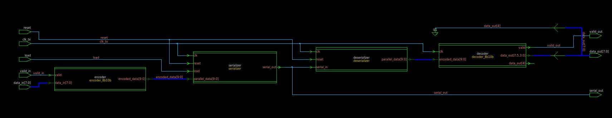
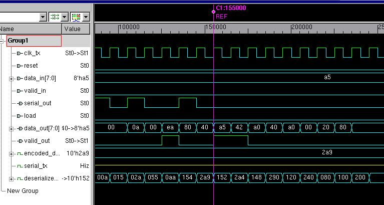
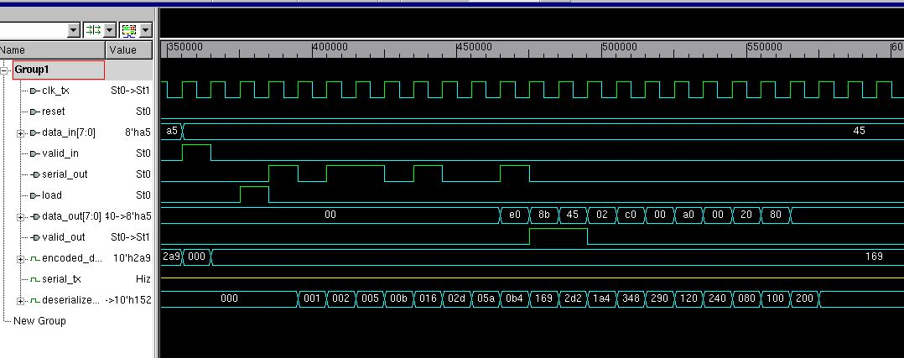
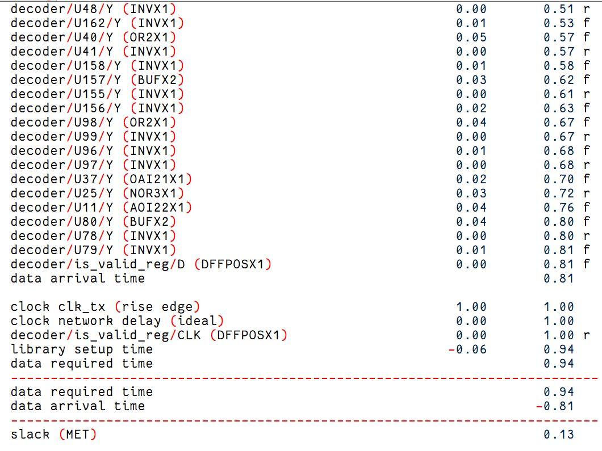
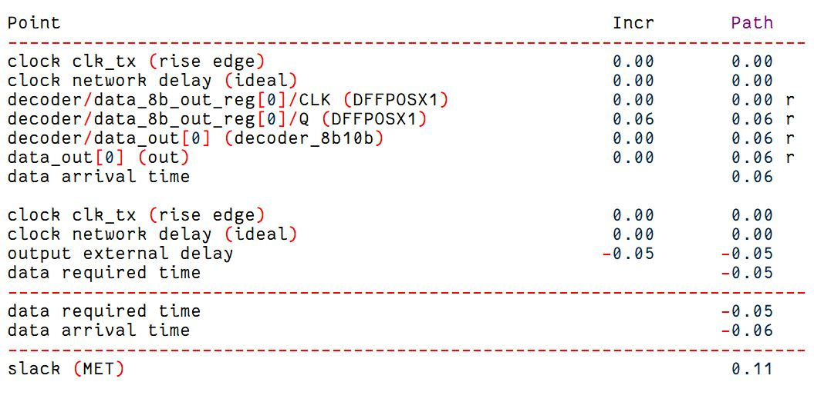
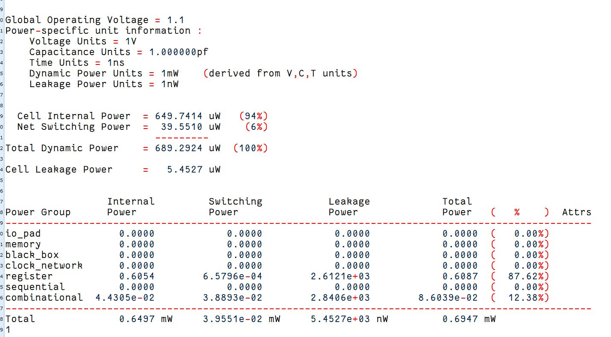

# SERDES-
Overview
This project implements a SerDes (Serializer/Deserializer) module with 8b/10b encoding and decoding in Verilog. It handles the following operations:

1 Transmitter (Serialization):
Converts 8-bit parallel data into a 10-bit encoded word and serializes it into a high-speed serial stream.
2 Receiver (Deserialization):
Deserializes the serialized stream, decodes the 10-bit word back into 8-bit data, and validates it.

Key Modules
1. serdes_8b10b
  The top-level module connecting the sub-modules:
  encoder_8b10b
  serializer
  deserializer
  decoder_8b10b
  encoder_8b10b

2. Encodes
   8-bit input data into a 10-bit format using predefined lookup mappings.

4. serializer
  Converts 10-bit parallel data into a serial bitstream.
  Controlled by a load signal to start the serialization process.

5. deserializer
  Converts a serial bitstream back into 10-bit parallel data.

7. decoder_8b10b
 Decodes 10-bit encoded data into 8-bit original data.
 Validates the integrity of the input.

8.tb_serdes_8b10b
Testbench for validating the functionality of the serdes_8b10b module.

Key Signals
Signal	    Direction	Description
clk_tx	    Input	Transmitter clock signal.
reset	      Input	Resets all registers and internal states.
data_in	    Input	8-bit parallel input data to be transmitted.
valid_in	  Input	Indicates valid input data for encoding and serialization.
load	      Input	Signal to load parallel data for serialization.
serial_out	Output	Serialized high-speed output.
data_out	  Output	8-bit parallel data after deserialization and decoding.
valid_out	  Output	Indicates valid output data.

Simulation Steps
Clock Generation:
The transmitter clock (clk_tx) operates at 100 MHz.
Reset:
All registers and logic states are reset initially.
Data Transmission:
Input data is fed into the system with valid_in set high.
The load signal triggers the serialization process.
Loopback Testing:
The serial_out is looped back to the receiver for testing.
Output Validation:
The 10-bit encoded data is deserialized and decoded into the original 8-bit data.

Future Improvements
Add error-checking mechanisms such as disparity or frame alignment in the encoding/decoding process.
Support for dynamic clock domains between the transmitter and receiver.
Extend testbench for randomized inputs and larger datasets.

